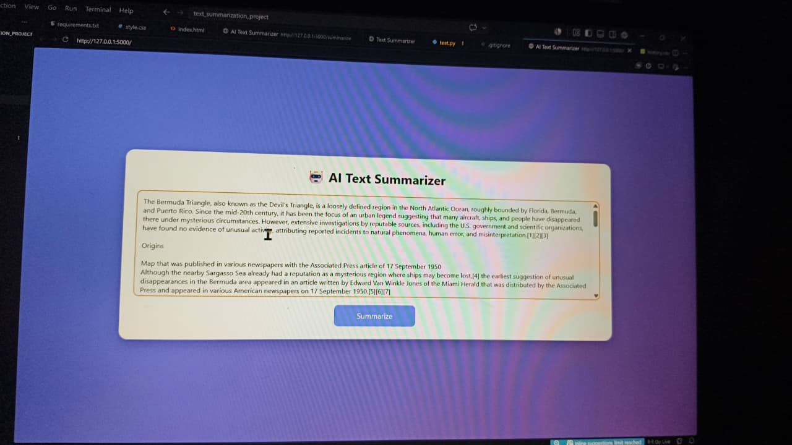
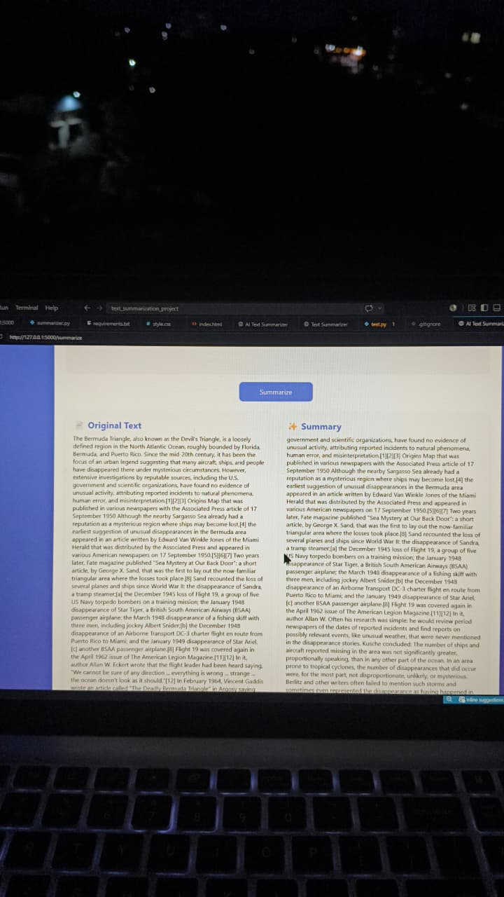
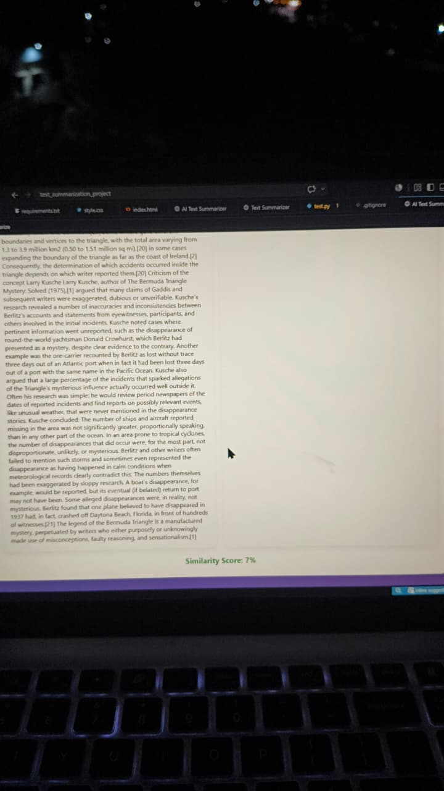

# AI Text Summarization Project

## Overview

This project is a Flask-based AI Text Summarization application that generates concise summaries from long paragraphs.

## Features

* Text Summarization
* Similarity Score Calculation
* Flask Web Interface
* Scikit-learn TF-IDF based summarization
* NumPy and Pandas integration
* FuzzyWuzzy similarity analysis

## Technologies Used

* Python
* Flask
* Scikit-learn
* NumPy
* Pandas
* FuzzyWuzzy
* HTML
* CSS

## Installation

```bash
pip install -r requirements.txt
python app.py
```

## Output

### Original Text



### Generated Summary



### Similarity Score




## Usage

1. Enter a paragraph.
2. Click Summarize.
3. View the generated summary and similarity score.

## Author

Sudheer
